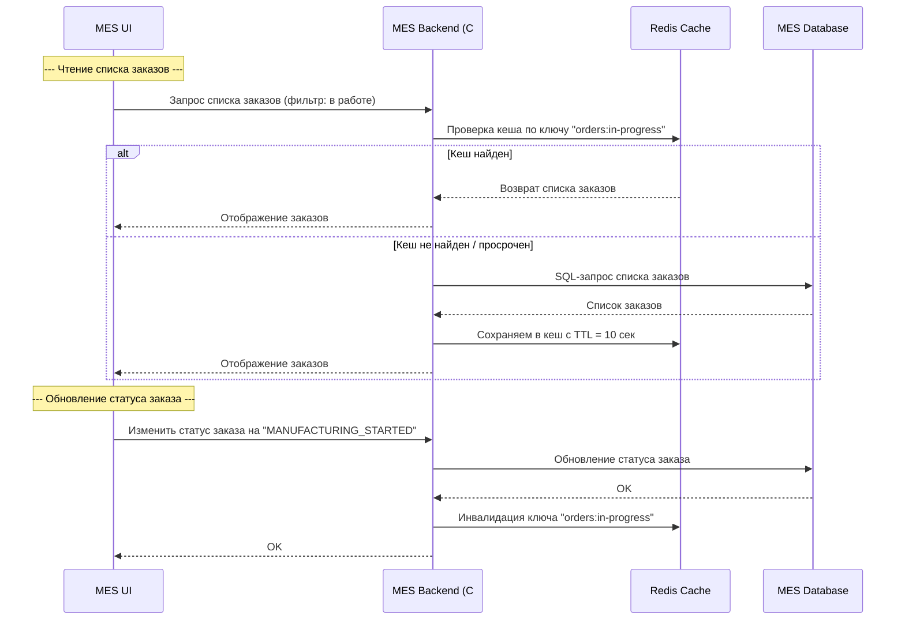

# Архитектурное решение по кешированию

## Мотивация

Кеширование предлагается как мера против нагрузочных, производительных и бизнес-проблем, вызванных ростом числа заказов и переходом к B2B-модели. Кеширование должно решить проблему переповтора тяжелых расчетов в MES и перегруженной главной страницы MES. 

## Предлагаемое решение

В текущей ситуации стоит внедрить серверное кеширование для MES сервиса. Выбор серверного кеширования обусловлен тем что критические узкие места находяться на серверной стороне.

Необходимо внедрить кеширование в следующие части работы MES

1. Кеширование результатов расчета стоимости в MES. Применяем паттерн Cache-Aside.

MES при получения запроса на расчет проверит, не применялся ли расчет для такой 3d модели, если да, то вернет уже расчитанную стоймость, если нет, то произведет расчет

Cache-Aside подойдет, так как он прост в реализации, работает только по запросу расчета.
Write-Through здесь не подойдет, так как расчет стоимости асинхронный и дорогостоящий - его не стоит запускать при каждой попытки записи.
Refresh-Ahead здесь избыточен, так как тут не нужно принудительное обновление кешированных данных

2. Кеширование дашборда заказов для операторов MES. Применяем паттерн Refreash-Ahead.

Данные часто одинаковые, свежие заказы со статусами. Кеш обновляется по таймеру (например, каждые 5 секунд или минуту) независимо от запроса пользователя

Cache-Aside не подойдет, так как даст задержки при поступлении новых данных.
Write-Throught бесполезен, так как применяется при привалирующих запросах на запись.

### Схема последовательности кеша и инвалидации кеша

### Стратегии инвалидации кеша

| Компонент системы | Стратегия инвалидации | Почему подходит | Почему не подходят другие |
|-------------------|------------------------|------------------|-----------------------------|
| Расчёт стоимости в MES | По ключу + TTL (например, 24 часа) | 3D-модели редко меняются, а повторные расчёты затратны. TTL защищает от устаревших значений, инвалидация по ключу возможна вручную при пересчёте. | Только временная — может задерживать инвалидацию  Программная — нет сигнала о пересчёте  Push/pub-sub — избыточно |
| Дашборд заказов в MES | Временная (короткий TTL) + автообновление (Refresh-Ahead) | Данные востребованы часто и по шаблону (по статусу). Предзагрузка позволяет избегать задержек при обращении к дашборду. | Cache-Aside — даст задержку на первом обращении  Программная — сложно отследить все обновления статусов  По ключу — слишком часто придётся инвалидировать |